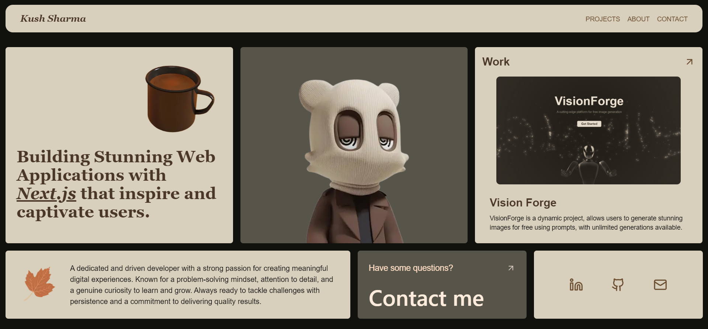

# Bentolio

Bentolio is a unique mix of a **Bento Grid** and a **Portfolio**, designed to showcase your skills and projects in an elegant and responsive layout. Inspired by the calming tones of autumn, Bentolio combines aesthetics with functionality to create a memorable digital experience.

## 🌟 Features
- **Single-Page Layout**: A seamless, scrollable page with a grid-based design.
- **Responsive Design**: Fully optimized for all devices, from mobile to desktop.
- **Autumn-Inspired Aesthetics**: Warm, soothing visuals inspired by the autumn season.
- **Interactive Animations**: Smooth and engaging animations using **Framer Motion** and **GSAP**.
- **Dynamic Grid**: Unique block-based layout to highlight different sections effectively.

## 🚀 Tech Stack
- **Framework**: [Next.js](https://nextjs.org/)
- **Styling**: [Tailwind CSS](https://tailwindcss.com/)
- **Animations**: [Framer Motion](https://www.framer.com/motion/) and [GSAP](https://greensock.com/gsap/)

## 🛠️ Installation & Setup
To run the project locally, follow these steps:

1. **Clone the Repository**:
   ```bash
   git clone https://github.com/Kushhhhhhhh/Bentolio.git
   cd bentolio
   ```

2. **Install Dependencies**:
   ```bash
   npm install
   ```

3. **Run the Development Server**:
   ```bash
   npm run dev
   ```
   The application will be live at `http://localhost:3000`.

## 📂 Project Structure
```
Bentolio/
├── public/           # Static assets (images, icons, etc.)
├── src/
│   ├── components/   # Reusable UI components
│   ├── app/        # Application routes
│   ├── utils/        # Helper functions
│   └── data/         # Content and configuration
├── package.json      # Project metadata and dependencies
└── README.md         # Project documentation
```

## ✨ Live Demo
Check out the live demo: [Bentolio Live](https://bentolio-design.vercel.app)

Feel free to fork, contribute, or reach out if you have any ideas or feedback. Happy coding!
